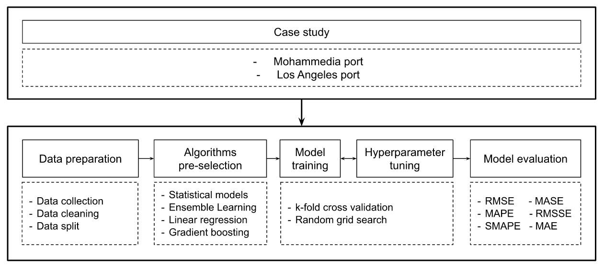

# Semi-AutoML for Vessel Traffic Flow Prediction

## Introduction

This repository contains code and resources related to the project titled "Applying Semi-AutoML for Vessel Traffic Flow Prediction: Case Studies of Two Ports." In this project, we explore the application of semi-Automated Machine Learning (AutoML) techniques for vessel traffic flow prediction. The case study focuses on analyzing data from two ports: Mohammedia and Los Angeles.

## Project Workflow

Our project follows this workflow to achieve accurate vessel traffic flow predictions:

1. **Dataset Selection:** We begin by selecting datasets for comparative analyses, specifically data from Mohammedia port and Los Angeles port.

2. **Data Preparation:** Data preparation involves a series of steps, including examination, processing, and aggregation of the selected data. This ensures that the data is in a suitable format for further analysis.

3. **Data Split:** The datasets are then divided into three subsets: training, testing, and validation sets. These subsets are essential for model training, unbiased evaluation, and validation.

4. **AutoML Evaluation:** Pre-selected machine learning algorithms are evaluated using the AutoML capabilities provided by the Pycaret framework. This helps us identify the top-performing models.

5. **Model Fine-Tuning:** The selected algorithms are fine-tuned to improve their performance. This step ensures that our models provide accurate vessel traffic flow predictions.

6. **Performance Evaluation:** We evaluate the fine-tuned models using various metrics such as Root Mean Squared Error (RMSE), Mean Absolute Percentage Error (MAPE), and more to assess their accuracy.

## Getting Started
You can access the [notebook in this repository](https://github.com/abdeltif-b/automl-prediction/blob/master/notebook.ipynb) for reference.
 
## Contact

If you have any questions or feedback, feel free to reach out to us:

- [Abdeltif B.](mailto:abdeltif.boujamza@gmail.com)

